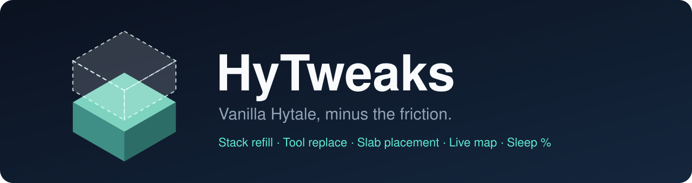
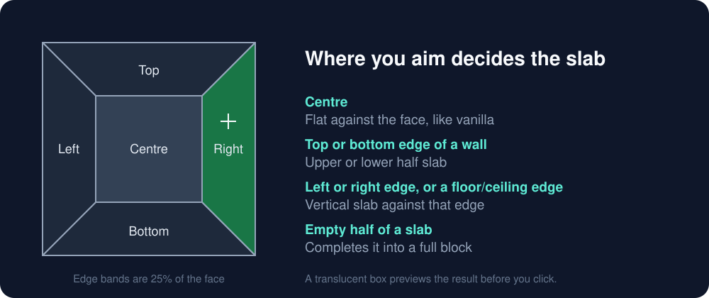

<p align="center">
  
</p>

<p align="center">
  <a href="https://github.com/phntmcc/HyTweaks/actions/workflows/build.yml"></a>
  
  <a href="LICENSE"></a>
</p>

HyTweaks is a small server-side plugin that smooths out everyday Hytale: your hotbar refills itself, broken tools get swapped, slabs go where you aim, and the map keeps up with your builds. It adds no items, blocks or UI, so the game still looks and plays like vanilla.

Nothing is needed on the client. Install it once on a server or single-player world and every player gets it.

## Features

| | |
|---|---|
| **Stack refill** | When the stack in your hand runs out (placing, eating, throwing), the same item moves in from your storage, backpack or the rest of your hotbar. Smaller stacks are used first, so partial stacks get tidied up. Dropping your last item never triggers it. |
| **Tool replace** | When your held tool or weapon breaks, a working one of the same kind takes its place. The broken one is kept for repair. |
| **Durability warning** | A notification and sound when your held tool drops to 10% durability, before it breaks mid-dig. |
| **Slab placement** | Aim at the centre or an edge of a face to choose how a slab is placed, and aim into a slab's empty half to complete it into a full block. A translucent box previews the result. |
| **Map refresh** | The world map shows your builds within about 2 seconds instead of after a rejoin. Only changed chunks are redrawn. |
| **Sleep percentage** | The night is skipped once half the players are in bed, instead of waiting for everyone. AFK and Creative players aren't counted, so they can't hold the night up. When everyone is asleep, vanilla's own sleep plays as normal. |

### Slab placement

<p align="center">
  
</p>

Vanilla places a slab on the side of a block vertically, wherever you aim. HyTweaks splits each face into five zones, so one slab can make floors, ceilings, half walls and corners. It works with every slab, including modded ones that use the standard half-block shape. Completing a slab plays its place sound, which fills in the sound vanilla is missing when it merges slabs.

## Install

1. Download `HyTweaks-<version>.jar` from [Releases](https://github.com/phntmcc/HyTweaks/releases).
2. Drop it into your server's or world's `mods/` folder.
3. Restart. Every feature is on by default.

Requires Hytale server 0.6.8 or newer.

## Configuration

`mods/phntm_HyTweaks/config.json` is created on first start. Every feature can be switched off with `"enabled": false`.

```json
{
  "refill":            { "enabled": true },
  "toolReplace":       { "enabled": true },
  "durabilityWarning": { "enabled": true, "threshold": 0.1, "sound": "SFX_Item_Break" },
  "sleepPercentage":   { "enabled": true, "percent": 50, "afkMinutes": 5 },
  "slabPlacement":     { "enabled": true, "preview": true, "previewOpacity": 0.15 },
  "mapRefresh":        { "enabled": true, "intervalSeconds": 2 }
}
```

| Option | Default | Meaning |
|---|---|---|
| `durabilityWarning.threshold` | `0.1` | Warn when durability falls to this fraction. |
| `durabilityWarning.sound` | `SFX_Item_Break` | Sound event played with the warning. |
| `sleepPercentage.percent` | `50` | Share of players in bed needed to skip the night. |
| `sleepPercentage.afkMinutes` | `5` | Players who haven't moved or looked around for this long aren't counted. `0` counts everyone. |
| `slabPlacement.preview` | `true` | Show the translucent placement preview. |
| `slabPlacement.previewOpacity` | `0.15` | Preview opacity, from 0 to 1. |
| `mapRefresh.intervalSeconds` | `2` | How often changed map areas are redrawn. Raise this on very large servers. |

Settings are server-wide. There are no commands and no per-player settings.

## Performance

HyTweaks is built for busy servers:

- Per-tick work exits immediately for players it doesn't affect, without allocating.
- Map updates are batched. Each changed chunk is redrawn at most once per interval, on the map's own thread, and only sent to players who already have it loaded.
- The slab preview sends packets only when your aim changes, and only to you.
- Per-player state is cleared automatically when a player leaves or changes world.

## Building from source

Requires JDK 25 and Maven.

```sh
mvn verify
```

The jar is written to `target/`.

## Contributing

Issues and pull requests are welcome. The project aims to stay small: each tweak is one class with no new items or UI, and pure logic is unit tested. To add a tweak, implement `core/Feature` and add it to the list in `HyTweaks.java`.

## License

[MIT](LICENSE)
